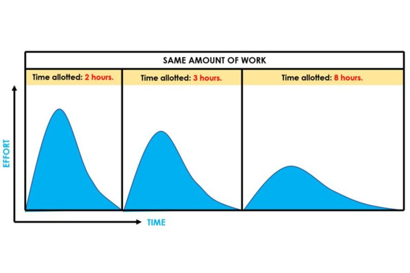

the work expands to fill the time available for its completion
the more resources not necessarly means more effective project execution
examples:
- windows vista - delays and obstacles even if the team was extremely big
- google 20% policy - need to change due to people stretching tasks to fit the time - ineficiencies
- basecamp - bootstraped saas -> small focused team - faster decision-making, less time for coordination

[[slow productivity by cal newport]] 
#productivity