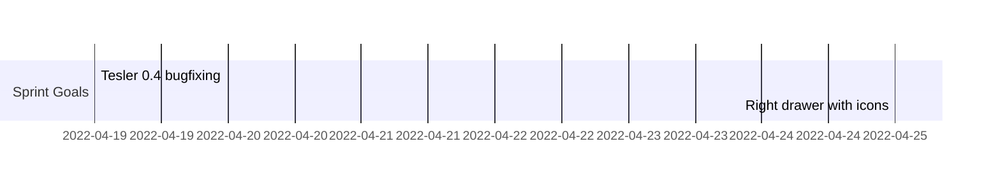

copy of github roadmap

🔔  This is a short roadmap of next sprints. We gather here main tasks, which should be decomposed to issues.
____
## Sprint 21.II - 4.III
-  🖥️  new _activity view_ 
-  🖥️ add routing
-  🖥️ divide EditProject component to EditTemplate and EditBundle (first steps)
- 🗿  new endpoint with with Tesler activities - for now just information about finished jobs
- 🗿  introduce new status in Tesler (divide `running` into `compiling`, `data_download`, `saving_data`, etd)
- 🏢  we want to talk about details of bundles view (aka _bundles table_) - for each bundle we need to somehow add actions of removing, executing etc.
- 🗿 tesler 0.5 on production
### Minimum Goal: New Activities View 🎉 🎉 🎉 

____
## Sprint 7.III - 18.III
- 🖥️ cleaning EditTemplate and EditBundle components
- 🖥️ create search component in activity view (just search without filtering)
- 🗿  track changes on saving templates and bundles
- 🗿  cron functionality bug fixing
### Minimum Goal: New activity type on Activities View 

____
## Sprint 21.III - 1.IV
- 🖥️  component with bundles in table - we want to have detailed information about bundles,
- 🖥️  create Material UI theme for entire project,
- 🖥️  on templates list add filtering component with new template button,
- 🗿 in sconfig to listBundles we want to add detailed list of bundles (with probably all bundle data), 
- 🗿 introduce many result channels
- 🏢  meeting about UI details
### Minimum Goal:  Bundles table with detailed informations
____
## Sprint 4.IV - 22.IV
- 🖥️  bugfixing UI in version 0.4,
- 🖥️  bugfixing UI in version 0.6,
- 🗿  bugfixing tesler in version 0.4,
- 🗿 bugfixing tesler in version 0.6,
### Minimum Goal: Fixed Tesler v0.4 on INAP prod
____
## Sprint 25.IV - 13.V
- 🖥️  on EditTemplate and EditBundle support for many result channels,
- 🖥️  on table with bundles show many result channels,
- 🖥️  on EditTemplate and EditBundle: on right drawer create icons for navigation on center view
- 🗿 cron functionality bug fixing
- 🗿 design Tesler alerts
- 🗿 move configurations tables from Cassandra to PostgreSQL - and copy all data,
### Minimum Goal: Create right drawer with icons for EditTemplate and EditBundle
____
🎉  🎉  legend:
🖥️ - Frontend tasks
🗿  - Backend tasks
🏢  - Meetings